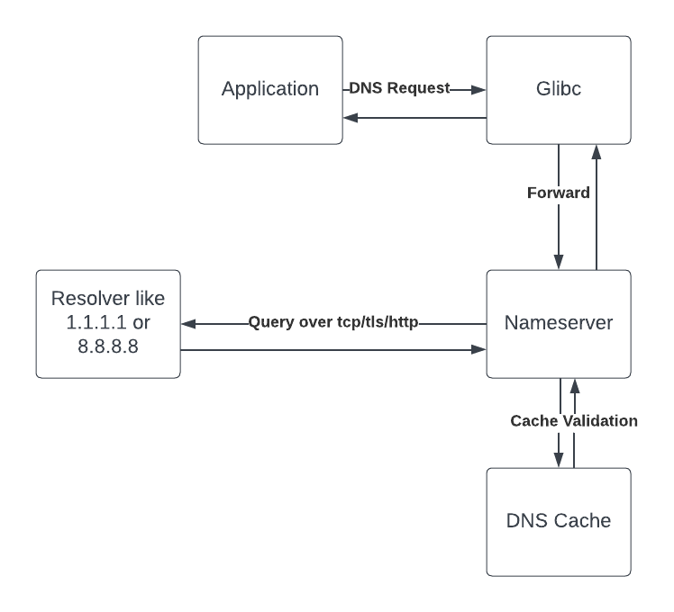

# Secure DNS using Pi-Hole
## What is Pi-Hole?
Pi-Hole is a network-wide ad-blocking service that operates as a Domain Name System (DNS) sinkhole. 

Pi-Hole works by intercepting DNS requests  This results in a faster and more private browsing experience.

It is typically used to block access to certain domain names, however it can also be used to redirect system DNS requests.

## DNS in Linux Kernel.


## Our Approach
We replace the nameserver of linux from systemd-resolve to our container.

# Setup
## Pre-setup : Freeing up port 53 from systemd-resolve

List the service running or port 53
```sh
sudo lsof -i :53
```
It generally is the systemd-resolved

```sh
sudo nano /etc/systemd/resolved.conf
```

Go to the Resolve section and change to-
```txt
[Resolve]
DNS=127.0.0.1
#FallbackDNS=
#Domains=
#LLMNR=no
#MulticastDNS=no
#DNSSEC=no
#DNSOverTLS=no
#Cache=no
DNSStubListener=no
#ReadEtcHosts=yes
```
Now run
```sh
sudo ln -sf /run/systemd/resolve/resolv.conf /etc/resolv.conf
```

Now reboot your system

## Running Container
Run the following command 
```sh
sudo docker compose up -d
```

## Accesing the admin portal
Visit 127.0.0.1:7003 and current password will be change me but you can change it in docker-compose.yml file.

